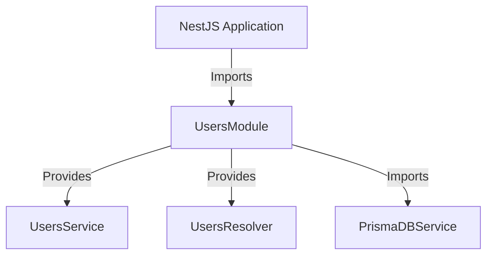
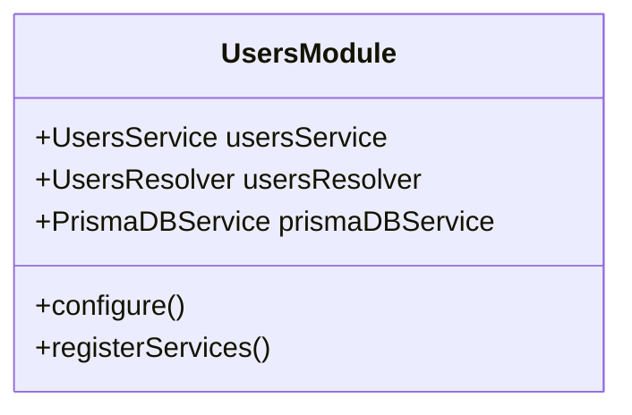
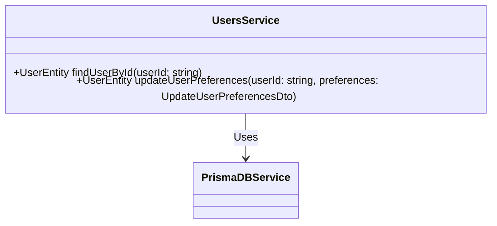
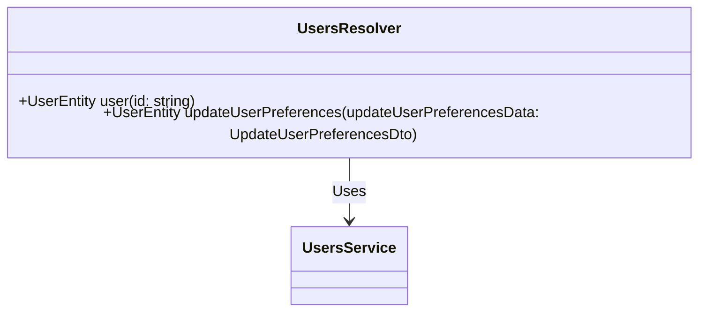
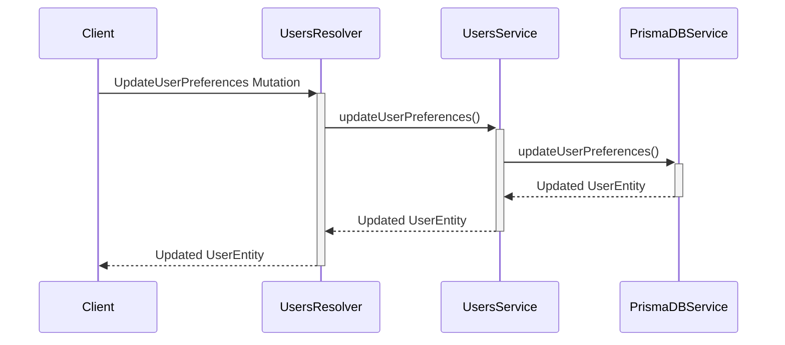

<p align="center">
  <a href="http://nestjs.com/" target="blank"></a>
</p>

### Microservice Documentation: Users Microservice

This documentation provides a detailed overview of the Users Microservice, focusing on the architecture, core components, and the flow of data and logic within the system.

#### Installation

To install and run the Users Microservice, follow these steps:

1. **Clone the repository:**

   ```bash
   git clone <repository-url>
   cd users-microservice
   ```

2. **Install dependencies:**

   Install the required dependencies using npm:

   ```bash
   npm install
   ```

3. **Setup Prisma:**

   Generate the Prisma client:

   ```bash
   npx prisma generate
   ```

4. **Environment Variables:**

   Ensure you have a `.env` file in the root directory with the necessary environment variables, such as database connection strings.

5. **Run the microservice:**

   To run the service in development mode with hot-reloading:

   ```bash
   npm run start:dev
   ```

   For production:

   ```bash
   npm run start:prod
   ```

#### Architecture

The Users Microservice is built using the NestJS framework, which provides a modular architecture. The core modules and services include:

- **UsersModule**: The main module for user-related functionality.
- **UsersService**: Contains the business logic for managing users.
- **UsersResolver**: Handles GraphQL queries and mutations for user operations.
- **PrismaDBService**: Connects the microservice to the database using Prisma ORM.

##### High-Level Architecture



#### Core Components

##### UsersModule

The `UsersModule` integrates all the components related to user management.



##### UsersService

The `UsersService` provides the business logic for user operations such as finding a user by ID and updating user preferences.



##### UsersResolver

The `UsersResolver` handles GraphQL queries and mutations. It interacts with `UsersService` to resolve user-related requests.



#### Flow of Data

The following sequence diagram illustrates the flow of data within the microservice when a user updates their preferences.



#### Summary

The Users Microservice is structured to handle user management efficiently within a larger application. The architecture is modular, making it easy to maintain and extend. The use of NestJS, GraphQL, and Prisma ORM ensures a robust and scalable solution. The documentation provides an overview of the key components and how they interact, illustrated with mermaid diagrams to visualize the architecture and data flow.

## License

Nest is [MIT licensed](LICENSE).
